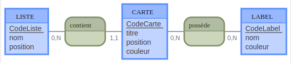

# MCD  

## MCD MOCODO  

---   

LISTE: CodeListe, nom, position  
contient, 0N LISTE, 11 CARTE  
CARTE: CodeCarte, titre, position, couleur  
possède, 0N CARTE, 0N LABEL  
LABEL: CodeLabel, nom, couleur  

  

Lien mocodo: http://mocodo.wingi.net/

note:  
**ENTITE**: **déterminant**, **propriété** .  
**association**, cardinalité entité, cardinalité entité.   
**cardinalité**: quantités **minimum** et **maximum** entre deux entités => **(0,1) (1,1) (0,n) (1,n)**.

