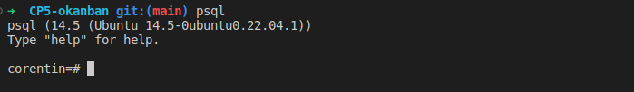
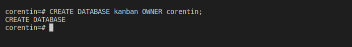
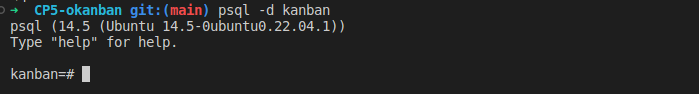
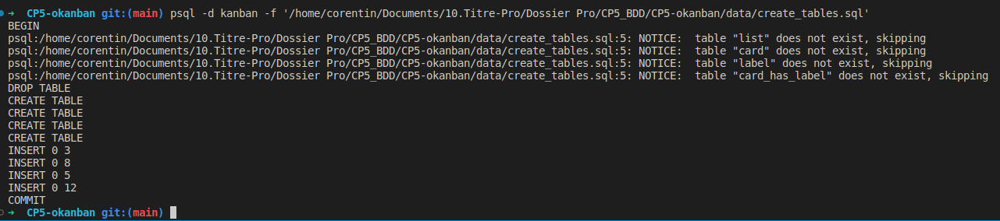

# PostgreSQL

Nous avons 5 commandes à effectuer afin de créer un base de donnée avec psql (dont trois optionnel)

- Exécuter le logiciel psql
- Créer un utilisateur (optionnel)
- Créer la base de données
- Tester la connexion à la base de données (optionnel)
- Exécuter un script SQL sur une base de données (optionnel)

## 1. Exécuter le logiciel psql

```bash
sudo -i -u postgres psql
```

## 2. Créer un utilisateur

```bash
CREATE USER nomDuLutilisateur WITH PASSWORD 'motDePasse';
```

## 3. Créer la base de données

```bash
CREATE DATABASE nomDeLaBase OWNER nomDuLutilisateur;
```

## 4. Tester la connexion à la base de données (optionnel)

```bash
psql -U nomDeLutilisateur -d nomDeLaBase
```

## 5. Exécuter un script SQL sur une base de données (optionnel)

```bash
psql -U numUtilisateur -d nomBaseDeDonnees -f chemin/du/fichier.sql
```

---

  note:

Lancer une commande en tant qu'admin  

```bash
sudo
```

init

```bash
-i
```

user

```bash
-u
```

database

```bash
-d
```

# Pratique

Dans mon cas j'utilise une variable d'environnement pour que chaque commande s'effectue avec un utilisateur défini au préalable, je n'ai alors pas besoin de le préciser dans certaine commande.  

## 1. Exécuter le logiciel psql

Grâce à ma variable d'environnement je peux simplement lancer cette commande :

```bash
psql
```



## 2. Créer la base de données

Je vais utiliser l'utilisateur 'corentin' déja créé au préalable:

```bash
CREATE DATABASE kanban OWNER corentin
```




## 3. Tester la connexion à la base de données (optionnel)

Grâce à ma variable d'environnement je dois uniquement préciser la base de donnée sur laquel je veux me connecter:

```bash
psql -d kanban
```



## 4. Exécuter un script SQL sur une base de données (optionnel)

```bash
psql -d kanban -f '/home/corentin/Documents/10.Titre-Pro/Dossier Pro/CP5_BDD/CP5-okanban/data/create_tables.sql'
```

